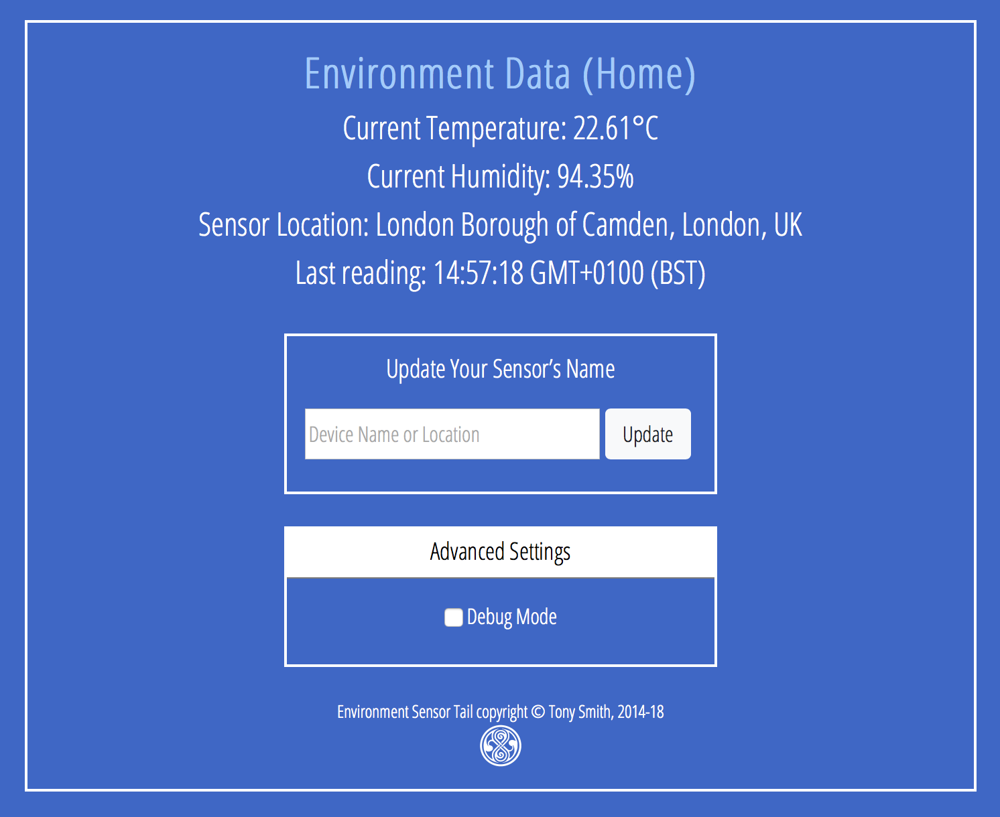

# EnvTailTempLog 1.5.6 #

A very simple Electric Imp-based environmental temperature/humidity sensor. It is built around the [imp001 card, ‘April’ breakout board](https://developer.electricimp.com/gettingstarted/devkits) and the Environment Sensor Tail (though this is no longer available to buy).

## Hardware ##

The imp001 slots into the April, the Environment Sensor Tail fits onto the April’s breakout connector pins. Plug it into a USB adaptor and you’re ready to begin. The complete hardware looks like this:

## Software ##

EnvTailTempLog requires a free Electric Imp developer account. To find out more and sign up for an account, please see the [Electric Imp Getting Started Guide](https://developer.electricimp.com/gettingstarted). This will tell you everything you need to know to get your environmental temperature/humidity sensor online.

The agent and device code included in this repository will need to be pasted into Electric Imp impCentral.

## Location ##

This code makes use of the [Location](https://github.com/smittytone/Location) class. If you are not using a tool like [Squinter](https://smittytone.github.io/squinter/) to combine multiple source files before uploading the application to the Electric Imp impCloud, you will need to paste the [Location](https://github.com/smittytone/Location) class code into the EnvTailTempLog source (both device and agent code) in place of the relevant `#import` line.

## Control UI ##

Visit your sensor’s agent URL for a simple control interface:

## Release Notes ##

- 1.5.6 *19 August 2020*
    - Bug fix: incorrect location for Bootmessage library.
- 1.5.5 *21 May 2020*
    - Update JQuery to 3.5.x.
    - Update Bootstrap to 4.5.x.
- 1.5.4 *18 December 2019*
    - Support Rocky 3.0.0.
- 1.5.3 *5 September 2019*
    - Update JQuery to 3.4.1, Bootstrap to 4.3.1, Bootmessage to 2.2.2.
- 1.5.2 *18 April 2019*
    - Update JQuery to 3.4.0, Rocky to 2.0.2.
- 1.5.1 *1 November 2018*
    - Update dependencies.
    - Minor code changes.
- 1.5.0 *1 August 2018*
    - Revise charting using Google charts.
    - Remove Dweet and Freeboard support.
    - Update to [Bootstrap 4.1.1](https://getbootstrap.com/).
        - Update Web UI based on Bootstrap.
        - Separate out Web UI into own file for clarity.
    - Add [DisconnectionManager](https://github.com/smittytone/generic/blob/master/disconnect.nut) support.
    - Upgrade [Rocky](https://developer.electricimp.com/libraries/utilities/rocky) to 2.0.1.
    - Update to [JQuery 3.3.1](https://jquery.com)
    - Prevent Ajax XHR caching.

## Licence ##

EnvTailTempLog is licensed under the terms and conditions of the [MIT Licence](./LICENSE).

Copyright &copy; 2020 Tony Smith
