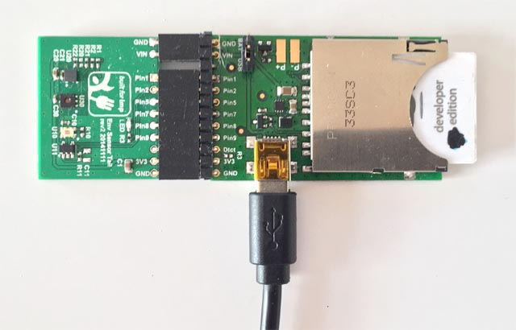

# EnvTailTempLog 1.1

A very simple Electric Imp-based environmental temperature/humidity sensor. It is built around the imp001 card, ‘April’ breakout board and the Environment Sensor Tail, all of which are available as a bundle [here](https://www.amazon.com/WiFi-Environmental-Sensor-LED-kit/dp/B00ZQ4D1TM).

## Hardware

The imp001 slots into the April, the Environment Sensor Tail fits onto the April’s breakout connector pins. Plug it into a USB adaptor and you’re ready to begin.

## Software

EnvTailTempLog requires a free Electric Imp developer account. To find out more and sign up for an account, please see the [Electric Imp Getting Started Guide](https://electricimp.com/docs/gettingstarted/).

The agent and device code included in this repository will need to be pasted into the Electric Imp IDE.

## Dweet and Freeboard

The sensor sends its data as a Dweet, so you will need to choose your own unique Dweet name (see [Dweet.io](https://dweet.io/play/)). Add your name to the appropriate place in the agent code.

You will also need to set up a free [Freeboard account](https://freeboard.io/signup). Add your Freeboard URL to the appropriate place in the agent code.

## Control UI

Visit your sensor’s agent URL for a control interface.

## Licence

EnvTailTempLog is licensed under the terms and conditions of the [MIT Licence](./LICENSE).

Copyright 2016-17 Tony Smith
